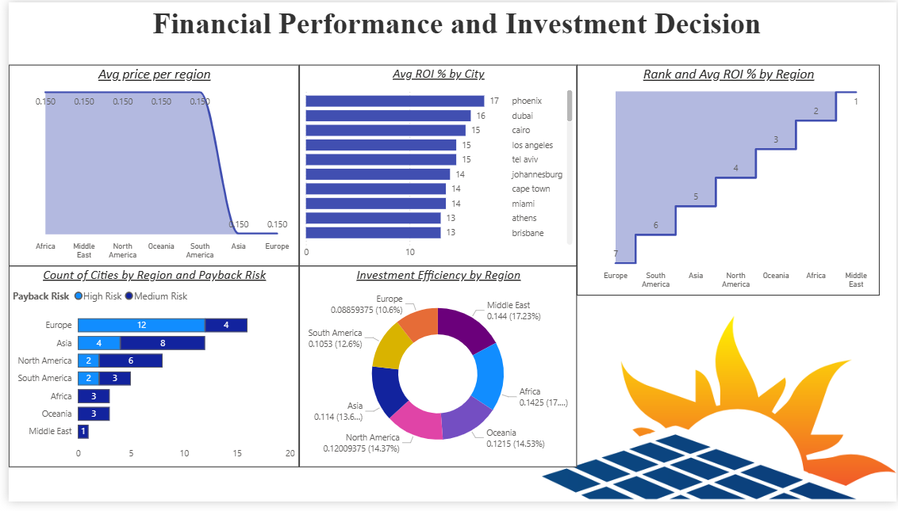

# Solar Energy Investment Analysis Dashboard 1 2 3 

## Project Overview

This project is an interactive Power BI dashboard designed to analyze the financial performance, investment efficiency, and sustainability impact of solar energy installations across multiple global regions.

The dashboard helps evaluate:
- ROI performance
- Payback risk
- Regional investment efficiency
- Sustainability impact
- Solar viability across cities and regions

The project combines financial analytics with renewable energy insights to support data-driven investment decisions.

---

## Tools & Technologies Used

- Power BI
- Excel
- DAX (Data Analysis Expressions)
- Data Visualization
- Financial Analysis

---

## Dataset Information

The dataset contains global solar energy data including:

- City and Country
- Geographic Coordinates
- Annual Sunlight Hours
- Daily Peak Sun Hours
- Global Horizontal Irradiance (GHI)
- Electricity Prices
- Solar Installation Cost
- ROI Percentage
- Payback Period
- CO2 Reduction
- Solar Viability Score
- Region-wise classification

---

## Dashboard Features

### Financial Performance Analysis
- Average ROI by city
- Region-wise ROI ranking
- Payback risk analysis
- Investment efficiency comparison

### Sustainability Analysis
- CO2 reduction insights
- Solar viability assessment
- Regional sustainability comparison

### Geographic Insights
- Region-based solar investment analysis
- City-level performance tracking

---

## Key Insights

- Middle East regions showed the highest ROI potential.
- Europe had lower payback risk compared to several regions.
- Cities with higher solar irradiance generally achieved better investment efficiency.
- Regions with strong sunlight exposure demonstrated higher sustainability benefits.

---

## Project Structure

```text
├── data/
├── dashboard/
├── screenshots/
├── README.md
```

---

## Dashboard Preview

### Financial Performance Dashboard



---

## Learning Outcomes

Through this project, I learned:

- Building interactive Power BI dashboards
- Creating DAX measures
- Financial KPI analysis
- Data storytelling
- Dashboard design principles
- Renewable energy investment analytics

---

## Future Improvements

- Add real-time API integration
- Create predictive forecasting models
- Deploy dashboard to Power BI Service
- Add advanced drill-through analytics
- Include machine learning-based ROI prediction

---

## Author

Abhay Singh

GitHub: https://github.com/AbhaySingh-ml
